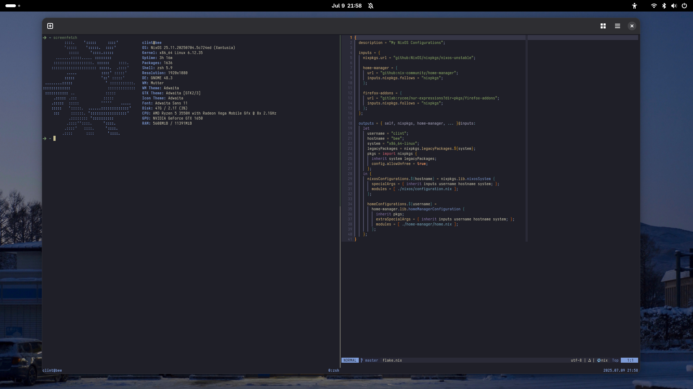

# ❄️ NixOS

My NixOS configuration.




## About

This repository contains my personal NixOS configuration. These configurations
are tailored to my setup and can be used as a base for configuring your own
NixOS environment.

I am not an expert in Nix or NixOS, as I've only been using NixOS since 23.11,
so there are plenty of improvements that can be made.


### Setup

As of the moment, I haven't fully migrated my Neovim to Nix since those
are too large to convert and dump to Nix.

```sh
ln -s "$(pwd)/config/nvim" ~/.config
```


### Management

I use flakes to manage my NixOS configuration. My home and system
configurations are managed with home-manager and nixos, respectively.

```bash
# Flakes
nix flake update
home-manager build switch --flake .
sudo nixos-rebuild switch --flake .

# Clean up
nix-env --list-generations
sudo /run/current-system/bin/switch-to-configuration boot
nix-store --gc && nix-collect-garbage -d
```
